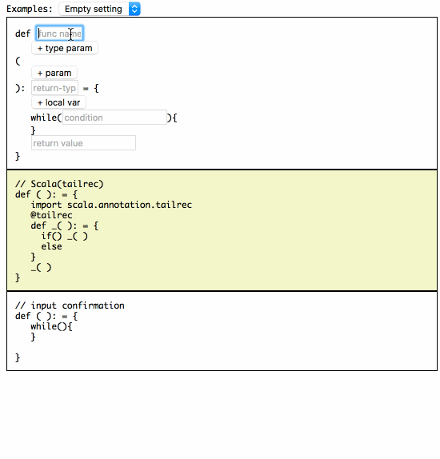

for-to-tailrec
==

Convertor a for-loop to a tail-recursive func

# Demo



# Page

http://nwtgck.github.io/for-to-tailrec/

# What is this?

Convert the following format for-loop to a tail-rec function!

```c
int <funcname>(int p1, int p2, <... int pn>){
   int local1 = _;
   int local2 = _;
   ...
   int localn = _;
   for(int i = [begin]; i > [end]; i -= [dec]){
     int prev_local1 = local1;
     int prev_local2 = local2;
     ...
     int prev_localn = localn;

     local1 = _
     local2 = _
     ...
     localn = _
   }
   return [ret-value];
}
```

# Example - Fibonacci


### C code

```c
int fib( int n ){
   int a = 1;
   int b = 1;
   for(int i = n; i > 0; i -= 1){
     int prev_a = a;
     int prev_b = b;
     a = prev_b;
     b = prev_a+prev_b;
   }
   return a;
}
```

==>

### Output (Haskell)

```haskell
-- Haskell
fib n = fib' n 1 1
   where
     fib' 0 a b = a
     fib' i a b = fib' (i - 1) (b) (a+b)
```

You can access http://nwtgck.github.io/for-to-tailrec/ and try other examples!
